# CrewAI Multi-Agent Triage

> **Naming note.** This repo has two "Module 3"s. The *product* build plan's Module 3 is the
> AI Inquiry & Triage Engine (this document). The *SecureDevOps* coursework Module 3 is the
> CI/CD pipeline. They are unrelated.

## What this is

`services/crew` is a fourth path through triage: the same classification → cost estimation →
technician matching, performed by three CrewAI agents that collaborate, rather than by three
function calls the endpoint makes in sequence.

It runs **alongside** the existing endpoints, which are unchanged and remain the default.

## Why not just replace the sequential path?

Three reasons, in order of how much they mattered:

1. **A baseline you can measure against.** Rewriting the endpoint would have left no way to say
   what the agent architecture costs. Keeping both means
   [`benchmark.py`](../services/crew/benchmark.py) can run identical inquiries down each path and
   produce [real numbers](benchmarks/crew-vs-sequential.md).
2. **Blast radius.** The crew depends on Groq being reachable and on the agents behaving. The
   sequential path degrades to a keyword classifier and documented heuristic cost ranges when
   Groq is unavailable. Making the crew the only path would have made an LLM outage a triage
   outage.
3. **Honesty.** The crew is slower and more expensive per inquiry. That is a real trade-off, and
   presenting it as a straight upgrade would misrepresent it.

## Architecture

```mermaid
graph TB
    subgraph Client
        REQ[POST /crew/process<br/>raw customer message]
    end

    subgraph "services/crew — port 8005"
        SEC[Security middleware<br/>API key · rate limit · headers]
        SAN1[Boundary sanitisation<br/>sanitize_prompt_input]

        subgraph "CrewAI — Process.sequential"
            A1[InquiryClassifierAgent<br/>tool: classify_inquiry]
            A2[CostEstimatorAgent<br/>tool: estimate_cost]
            A3[TechnicianMatcherAgent<br/>tool: recommend_technician]
        end

        SAN2{{Inter-agent sanitisation<br/>task_callback}}
        GUARD[Determinism guard<br/>_verify_cost]
    end

    subgraph "Existing services — unchanged"
        TR["triage :8001<br/>/triage/classify — Groq<br/>/triage/estimate-cost — XGBoost + SHAP"]
        DP["dispatch :8004<br/>/dispatch/recommend — SQL scoring"]
    end

    GROQ[Groq<br/>llama-3.3-70b-versatile]

    REQ --> SEC --> SAN1 --> A1
    A1 -->|task context| SAN2 --> A2
    A2 -->|task context| SAN2
    SAN2 --> A3
    A1 -.X-API-Key.-> TR
    A2 -.X-API-Key.-> TR
    A3 -.X-API-Key.-> DP
    A1 & A2 & A3 -.reasoning.-> GROQ
    A3 --> GUARD --> RESP[Structured result<br/>+ per-agent trace]
```



## The three agents

| Agent | Role | Tool | Wraps |
|---|---|---|---|
| `InquiryClassifierAgent` | Customer Inquiry Classification Specialist | `classify_inquiry` | `POST /triage/classify` |
| `CostEstimatorAgent` | Service Cost Estimation Specialist | `estimate_cost` | `POST /triage/estimate-cost` |
| `TechnicianMatcherAgent` | Technician Assignment Specialist | `recommend_technician` | `POST /dispatch/recommend` |

Each is modelled as a role with a goal and a backstory because that is what the LLM conditions
on — a classifier told it has spent fifteen years on the phones behaves measurably differently
from one told "classify this text".

**Delegation is disabled** on all three (`allow_delegation=False`). With it on, an agent that
struggles can hand its task to another — which sounds useful until the classifier starts
producing cost estimates without ever calling the XGBoost tool. The deterministic work must stay
deterministic, so each agent owns exactly its own step.

### Why the tools call HTTP instead of importing Python

`services/triage/main.py` builds its FastAPI app, applies middleware, connects the database and
calls `load_model()` **at import time**. Importing its helpers from a crew package inside that
same service is a circular import, and would force a refactor of a working service.

Separating the crew also keeps CrewAI's dependency tree (litellm, instructor, openai, tiktoken)
away from triage's `numpy>=1.26,<2.5` pin, which `shap`'s numba requires. That conflict is not
hypothetical — CI installs all services' requirements into one interpreter, so it would have
surfaced there even though the containers are isolated. Hence the separate `test-crew` job in
`ci.yml`.

The cost is one network hop per tool call, which the benchmark measures rather than hides.

## Task context chaining

The three tasks declare their dependencies explicitly:

```python
estimate_cost_task  = Task(..., context=[classify_task])
match_technician_task = Task(..., context=[classify_task, estimate_cost_task])
```

CrewAI injects the prior tasks' outputs into the next agent's prompt. This is the actual
difference from the sequential path: the endpoint no longer marshals data between steps by hand,
so adding a fourth specialist is a configuration change rather than an endpoint rewrite.

## Security model

The other four services sanitise user input once, at the HTTP boundary. **That is not sufficient
for a crew**, and this is the part most CrewAI implementations miss.

In a chained crew, Task 1's *output* becomes Task 2's *prompt*. A payload that survives
classification — or one the classifier is manipulated into emitting — is injected straight into
the next agent's context without ever crossing the HTTP boundary again. The boundary check never
sees it.

So `crew.py` registers a `task_callback` that re-runs `sanitize_prompt_input()` on every task
output before it is chained forward, and logs when it actually changed something:

```python
def _sanitise_task_output(output: TaskOutput) -> None:
    cleaned = sanitize_prompt_input(output.raw or "")
    if cleaned != output.raw:
        logger.warning("Inter-agent sanitiser modified output — possible injection attempt")
        output.raw = cleaned          # mutate in place: chained context reads this object
```

It mutates `output.raw` **in place** deliberately — returning a cleaned copy would leave the
downstream agent reading the original payload. There is a test for exactly that
(`test_inter_agent_sanitiser_scrubs_task_output`).

**Stated limitation:** this scrubs known injection markers. It does not make agents immune to
adversarial instructions phrased as ordinary English, which remains an open research problem.

Other controls, unchanged from the Module 2 pattern:

- API key required on `/crew/process` — an unauthenticated caller must never be able to spend
  LLM tokens, and there is a test asserting the 401 lands before any crew work starts
- `extra="forbid"` and `max_length` on the request model
- Per-IP rate limiting and security headers via `security.setup`
- Tools authenticate to triage and dispatch with `X-API-Key`
- `memory=False` — CrewAI's memory would persist context across requests, leaking one customer's
  inquiry into another's, and pulls in a vector store this service has no use for

## The determinism guard

This is the correctness risk specific to putting an LLM in front of an ML model.

`/triage/estimate-cost` returns an exact number from a trained XGBoost regressor. An agent that
*narrates* that number can round R11,280.65 to "about R11,000", restate a range, or recompute it.
On a customer-facing quote, that is a silent regression.

So `tools.py` records every tool's untouched response in thread-local storage, and after
`kickoff()` the service compares what the crew reported against ground truth:

```python
cost_estimate, overridden = _verify_cost(output, tool_results)
```

On disagreement the **tool's value wins**, the response carries
`"cost_estimate_overridden": true`, and a `SecurityLogger` event fires. A hallucination that
would otherwise be invisible becomes a counted, queryable metric.

Thread-local rather than a module global because FastAPI runs the blocking `crew.kickoff()` in a
threadpool — a plain dict would let concurrent requests read each other's tool results.

## LLM backend: Groq or AWS Bedrock

The crew's LLM is chosen entirely by `CREW_MODEL`'s litellm provider prefix — `groq/<model>`
(default) or `bedrock/<model-id>`. No code branches on which one is active; `agents.py`'s
`build_llm()` passes the string straight to `crewai.LLM`, and litellm routes it.

The only place the two providers genuinely differ is **readiness checking**. Groq has exactly
one env var (`GROQ_API_KEY`) whose presence is a reliable signal. Bedrock has none — boto3
resolves credentials from an access key pair, a shared profile, or an attached IAM role, and
there is no single variable whose absence definitively means "this will fail". `llm_backend_ready()`
in `agents.py` checks the plausible candidates and says so honestly in its docstring: this is
"credentials might exist somewhere in the chain", not "verified working". The only real
verification is a call actually returning.

Switching to Bedrock also requires **manually granting model access** in the Bedrock console
(Model access, per model, per account) — something no amount of correct code or Terraform can
do on your behalf, and a common reason a first Bedrock call fails with an access-denied error
that looks like a bug but isn't.

Measured comparison: [`docs/benchmarks/bedrock-vs-groq.md`](benchmarks/bedrock-vs-groq.md)
(pending — generated by `services/crew/benchmark_bedrock.py`, which needs real Bedrock
credentials and spends real tokens; does not exist until that script is run).
That script calls `crew.build_triage_crew(model=...)` directly for both providers in one
process — bypassing `main.py`'s cached single crew, which is built once from `CREW_MODEL`
at process start and can't be switched at runtime without a restart.

## Trade-offs

See [the benchmark](benchmarks/crew-vs-sequential.md) for measured figures. In summary:

**Costs.** Three LLM calls plus tool-calling round trips instead of one; a network hop per tool
call; materially higher latency and token spend per inquiry.

**Buys.** Each step is an independently described role with its own tools and constraints.
Adding a specialist, or letting the cost agent ask the classifier to clarify a vague inquiry, is
configuration rather than a rewrite. The per-agent trace returned in `agent_steps` also makes the
reasoning inspectable in a way the sequential path never was.

Whether that is worth it depends on how often the workflow changes. For a fixed three-step
pipeline it probably is not; the value appears when the workflow is still moving.

## Known issues in the wrapped services

Found while mapping the logic these tools call. **Not fixed here** — changing scoring behaviour
belongs in its own change, not one adding a new service:

- `area_match` is computed in both `services/triage/main.py` and `services/dispatch/main.py` and
  never used in the `combined` score. The scoring claims to weight area familiarity but the
  `area_match` term specifically is dead.
- `/triage/assign-technician` and `/dispatch/recommend` are near-duplicates with **different
  constants** — skill-miss penalty `0.3` vs `0.2`, area-miss `0.5` vs `0.3`. They are not
  interchangeable. The crew uses dispatch, which also returns a human-readable `explanation`.
- In `/triage/estimate-cost`, `hist_min`/`hist_max`/`hist_avg` are only bound inside
  `if result.cnt > 0`. A successful query returning zero rows would leave them unbound. Currently
  unreachable because `similar_count` stays 0, so they are never read.

## Running it

```bash
docker compose up -d postgres triage dispatch crew
curl localhost:8005/crew/health

curl -X POST localhost:8005/crew/process \
  -H "X-API-Key: rams-elec-frontend-2026" \
  -H "Content-Type: application/json" \
  -d '{"raw_message":"cold room in Sandton is not cooling, stock at risk"}'
```

`verbose=True` on the crew means the full agent reasoning appears in `docker compose logs crew`.

Without `GROQ_API_KEY` the service answers `503` with a clear reason rather than failing at
import — same degradation contract as triage and chatbot.
