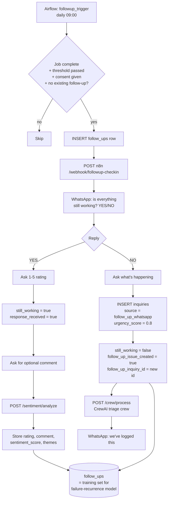

# Module 10 — Post-Service Satisfaction & Equipment Follow-up Agent

## Status

| Part | What | Status |
|---|---|---|
| A | `FollowUp` table, consent fields, `Equipment.riskScore` | ✅ Schema + migration written (**not applied**) |
| B | Airflow trigger DAG (`etl/dags/followup_trigger_dag.py`) | ✅ Built |
| C | n8n WhatsApp conversation workflow | ⚠️ **Designed, not provisioned** — see [WhatsApp reality check](#whatsapp-reality-check) |
| D | Sentiment analysis service (`services/sentiment`, :8006) | ✅ Built + tested |
| E | Failure-recurrence model | ⏳ Deferred — cannot train yet, see [cold start](#the-cold-start-problem) |
| F | Dashboard "Customer Satisfaction" page | ⏳ Deferred until data exists |
| G | This document | ✅ |

---

## Why customer-reported outcomes instead of IoT sensors

`docs/phase2/roadmap.md` defers the IoT Predictive Maintenance Hub for a specific reason:

> Rams @Elec has no sensors installed at client premises. Training on fabricated sensor data
> would have no real-world validity and would be misleading to demonstrate.

That reasoning still holds. But the *goal* behind it — knowing which equipment is likely to fail
again — doesn't require sensors. It requires a **failure label**, and a customer answering
"no, it's not working" seven days after a repair is exactly that label, gathered at almost zero
marginal cost through a channel the business already uses.

So this module is not a replacement for the IoT hub. It's the cheaper path to the same target
variable, and it produces data that is genuinely real rather than fabricated.

**Trade-off, stated plainly:** sensor telemetry is continuous, objective and high-resolution.
Customer reports are sparse, subjective, and biased — people who are annoyed reply more readily
than people who are content, and "still working?" is a much coarser signal than a compressor's
current draw. This buys a real label at the cost of precision. It does not make the IoT route
unnecessary; it makes it non-blocking.

---

## Conversation flow



### Trigger thresholds

| Job urgency | Days after completion |
|---|---|
| `emergency`, `high` | 3 |
| `medium`, `low` | 7 |

Urgent work gets the shorter window because if that repair failed, the customer is living with
the consequences *now* — a cold room that's warming again is a stock write-off in progress, not
something to discover next week.

---

## POPIA — consent is a schema field, not terms copy

South Africa's Protection of Personal Information Act requires that consent be **specific,
informed, and voluntary for each processing purpose**. Sending post-service satisfaction
messages is a different purpose from sending load-shedding outage alerts.

The schema already had `Customer.alertSubscribed`, scoped to load-shedding alerts. Reusing that
flag to justify satisfaction messaging would be precisely the consent-creep POPIA prohibits — a
customer who opted into outage warnings did not thereby agree to be surveyed about their repair.

So Module 10 adds a separate, purpose-specific field:

```prisma
followUpConsent   Boolean   @default(false) @map("follow_up_consent")
followUpConsentAt DateTime? @map("follow_up_consent_at")
```

**Consent is enforced in SQL, in the DAG's selection query** — not in application code:

```sql
WHERE j.status = 'complete'
  AND c.follow_up_consent = true   -- POPIA precondition
  AND c.whatsapp IS NOT NULL
```

This placement is deliberate. A customer without consent is never *selected*, so no downstream
code path — a bug in n8n, a manual replay, a future refactor — can message them by accident.
The check cannot be forgotten because there is no code path that skips it.

**Still outstanding for real deployment:**
- A consent capture point in the booking flow (customer portal / service agreement), writing
  `followUpConsent` and `followUpConsentAt`.
- A documented withdrawal mechanism ("reply STOP"), which POPIA also requires.
- A retention policy for `commentText`, which is free-text personal information.

---

## WhatsApp reality check

**Part C is a design artifact. It has not been provisioned or tested.** Same honest framing as
the Terraform/Azure work in `docs/cloud-security-architecture.md`.

Three concrete blockers stand between this JSON and a working integration:

1. **Meta template approval.** The first message is *business-initiated* and lands outside the
   24-hour customer service window, so WhatsApp requires a **pre-approved message template**.
   That's a Meta review process, not a config value.
2. **No Twilio code exists anywhere in this repo.** Grep confirms it: Twilio appears only in n8n
   workflow JSON and documentation. All sending is delegated to n8n.
3. **Costs real money per message**, so it cannot be exercised in CI or from a test run.

### What the new workflow fixes relative to the existing ones

`n8n/workflows/triage_inquiry_workflow.json` calls `http://localhost:8001/triage/classify` with
**no `X-API-Key` header**. Since the Module 2 security hardening, every FastAPI service is
API-key gated — that call would return 401 today. The pre-existing workflows predate the
middleware and were never updated.

The follow-up workflow sends `X-API-Key` on every internal call, and uses `TWILIO_WHATSAPP_FROM`
(which is defined in `.env.example`) rather than `TWILIO_PHONE_FROM` (which the triage workflow
references but which does not exist).

> The three older workflows are left as-is — fixing them is a separate change with its own
> testing needs, and silently editing them here would bury it in an unrelated module.

---

## The cold-start problem

The failure-recurrence model (Part E) predicts whether repaired equipment will fail again, using
`still_working = false` as the target label.

**It cannot be trained yet.** There are currently zero `follow_ups` rows. The training script
will carry a hard guard:

```
Insufficient data for training (minimum 100 labeled follow-ups required).
Currently have: {count}. Model training skipped.
```

This is the same standard the Phase 2 roadmap applies to IoT and computer vision: a model
trained on fabricated data is worse than no model, because it produces confident numbers with no
validity behind them.

**What exists today is the pipeline that generates valid training data.** That is the honest
claim, and it's the one the README and this document both make. Planned features once the
threshold is met:

| Feature | Source |
|---|---|
| `equipment_type` | `equipment.type` |
| `equipment_age_at_service` | `jobs.completed_date - equipment.install_date` |
| `original_fault_category` | `service_types.category` |
| `technician_id` | `jobs.technician_id` |
| `days_since_service` | `follow_ups.days_since_completion` |
| `area_zone` | `jobs.area_zone` |
| `job_urgency_at_time` | `jobs.urgency` |

Class imbalance is expected (most repairs hold), so training will need SMOTE or class weighting,
5-fold cross-validation, and SHAP attribution — matching the approach already used by the quote
estimator in `services/triage/train_model.py`. Predictions write back to
`equipment.risk_score` / `equipment.risk_scored_at`.

---

## How this connects to the rest of the platform

| Module | Connection |
|---|---|
| **Maintenance Schedule** | `MaintenanceSchedule` already relates Equipment ↔ Customer. Once `equipment.risk_score` is populated, high-risk equipment is surfaced for proactive review rather than waiting for the fixed `intervalMonths` cycle. |
| **Triage Engine / CrewAI crew** | A "NO, it's not working" reply creates an `Inquiry` and hands it to `POST /crew/process` — the same multi-agent triage path a fresh inquiry takes. Recurring faults enter the normal workflow instead of a parallel one. |
| **Sentiment service** | `POST /sentiment/analyze` (:8006) scores the optional free-text comment and tags it against a fixed taxonomy. |
| **Analytics Dashboard** | Part F adds a "Customer Satisfaction" page: response rate, rating trend, theme breakdown, recurring-issue counts, and the equipment risk table once populated. |
| **NotificationLog** | Every follow-up message logs to the existing `notification_log` table with `message_type = 'followup_checkin'` — no parallel logging table. |

---

## Data model note — why the follow-up inquiry isn't linked via `assignedJobId`

`Inquiry.assignedJobId` is `String? @unique` — a **1:1** relation. The original job already
consumed it (that's the inquiry which became the job). Creating a second inquiry pointing at the
same job would violate the unique constraint.

The join path is instead:

```
Job  <--jobId--  FollowUp  --followUpInquiryId-->  Inquiry
```

`FollowUp` already carries both foreign keys, so no schema change to `Inquiry` was needed.

Similarly, `Inquiry` has no string `urgency` column — it has `urgencyScore Float?` (0.0–1.0).
Follow-up issues are created with `urgency_score = 0.8`, reflecting that a fault recurring after
a completed repair warrants elevated priority.

---

## Applying the migration

The migration is **written but not applied**. Review
`packages/db/prisma/migrations/20260726000000_followup_agent/migration.sql`, then:

```bash
cd packages/db && npx prisma migrate deploy
```

Note that `npm run db:migrate` is hardcoded to `--name init` and is **not** the right command
here. All three changes are additive and nullable/defaulted, so the migration is safe against a
populated database with no backfill step.
